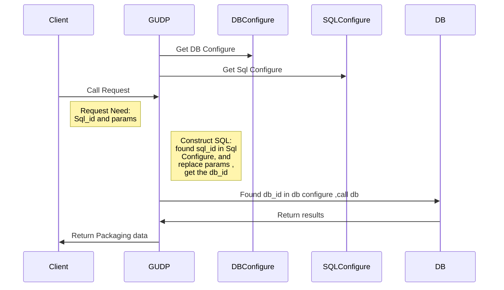

# GRPC Unified Data Proxy(GUDP)
GUDP is a Unified Data Proxy using GRPC. Currently support mysql and redis(redis is an EXPERIMENTAL Feature.). Later will add more data source support. Developers only need to use GRPC to invoke this service without concern for database connection and query details. Meet most data service requirements, and pursue simplicity, lightweight and scalability. 

## GUDP features:
* Unify data access.
* Connections convergence. Several thousands of data request connections in the business layer. If you directly connect to the database, it will cause a waste of database resources. After GUDP, the number of links to the database can be optimally utilized.
* Work hard to make it more scalable and support more data sources.
* Horizontal expansion, business independence
### MYSQL:
* Easy to use, modify the query logic does not need to change the business code, just change the GUDP SQL configuration statement. If you want to switching the database, just change the GUDP DB configuration.
* Security, business layer will not be exposed to the data source. Through the replacement of parameters to achieve data query, a good defense SQL injection.
* Supports DB fragmentation.
* Support multi-database transaction commit.

**Cons:** GUDP In order to make the caller more easily obtain the data, GUDP fetches the data from the database and encapsulates it into a structure easily accessible by the business layer. Performance will be consumed. However, if the general business layer uses a database, the amount of data will not be large,  Therefore, the delay of a few milliseconds of query has little impact on service access. If there are many query result sets, for example, if a statistical program needs to query and output 1 million data, GUDP is not suitable.

### REDIS:
* Easy to use.   



___

# 简介
GUDP是一个统一访问代理．目前支持mysql. Redis是实验特性,仅实现部分. 后面会添加更多数据源支持.
开发人员只需要使用GRPC调用本服务,无需关心数据库连接和查询细节.满足大部分的数据服务需求,并且追求简单,轻量化以及扩展性.使用GO语言编码.
## GUDP特性:
* 使得数据访问统一化
* 链接收敛.业务层几千个数据请求链接,如果直接访问数据库,会造成数据库资源浪费的问题.通过GUDP后,到数据库的链接个数能达到最优利用.
* 努力使其具备更好的扩展性,支持更多的数据源.
* 水平扩容，业务无关。

MYSQL功能比较完善，目前有如下特性：
* 简单易用,修改查询逻辑不需要改业务代码或者切换数据库,只需要改动GUDP的SQL配置语句.
* 读写分离
* 安全,业务层不会接触到数据源.通过参数替换达到数据查询效果，屏蔽了注入SQL的途径.
* 支持数据库分片.  
* 支持多数据库事务提交.  

**缺点：**
为了做到简单易用对业务友好，GUDP从数据库取出数据会封装成业务层容易获取的结构。性能会有所消耗。但一般业务层使用数据库，数据量不会很大，查询延时多个几毫秒对业务访问几乎没有影响。如果查询结果集很多，如某统计程序需要一次查询输出10万条数据之类的需求，GUDP就不适合。

> 1000条数据的时候，几乎感觉不到延迟;
> 10万条数据GPS记录，直接访问数据库花了2.2秒，用GUDP需要3.5秒。
> 后面会补上性能测试报告。

REDIS是实验性功能:
* 简单易用,配置好配置文件就可访问redis.业务层不无关系链接细节.


## Example:
Mysql Read Write Spilting  
[MYSQL读写分离实现](doc/mysql_read_write_splitting.md)。 

Mysql Sharding Example  
[MYSQL数据库分片实现](doc/mysql_db_sharding.md)。 

Mysql Multi DB Transcation  
[MYSQL多数据库事务实现](doc/mysql_multi_db_transaction.md)。 


### Mysql:
[Mysql Test Client](client/mysqlcli.go)  
[mysql db configure](conf/mysql/db)  
[mysql sql configure](conf/mysql/sql)  
[Test DB Create](doc/mysqldata.sql)  

```
Step 1:
go get -u github.com/toniz/gudp

Step 2: Install Mysql and Run mysql Service on Port: 4000

Step 3:
mysql -u root -h 127.0.0.1 -P 4000 < $GOPATH/src/github.com/toniz/gudp/doc/mysqldata.sql 

Step 4:
export GRPC_GO_LOG_SEVERITY_LEVEL=INFO
nohup gudp &

cd $GOPATH/src/github.com/toniz/gudp/client
go build mysqlcli.go 
./mysqlcli
```

### Redis:
[Redis Test Client](client/rediscli.go)  
[Redis Srv Configure](conf/redis/srv)  

```
cd $GOPATH/src/github.com/toniz/gudp/client
go build rediscli.go 
./rediscli

```


